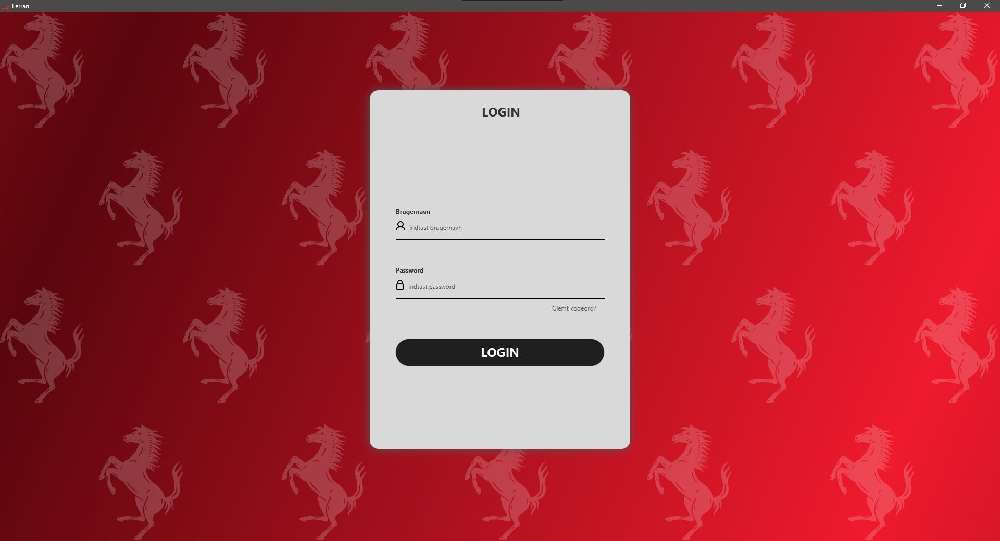
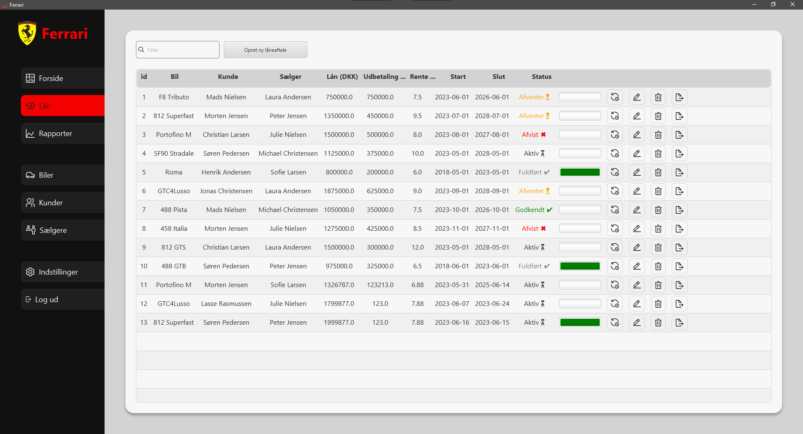
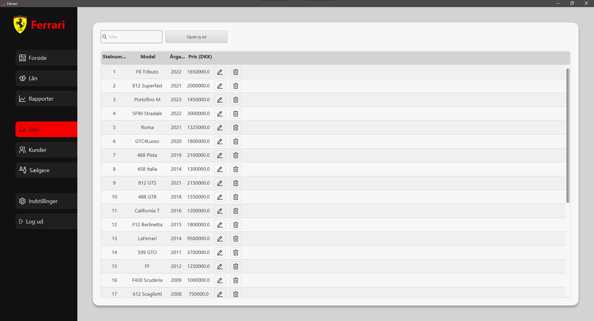
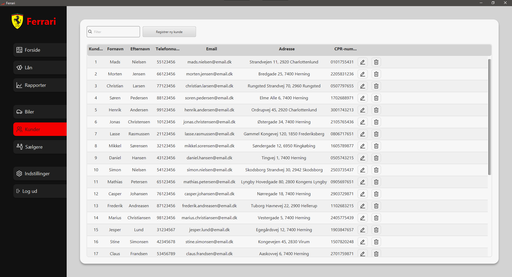
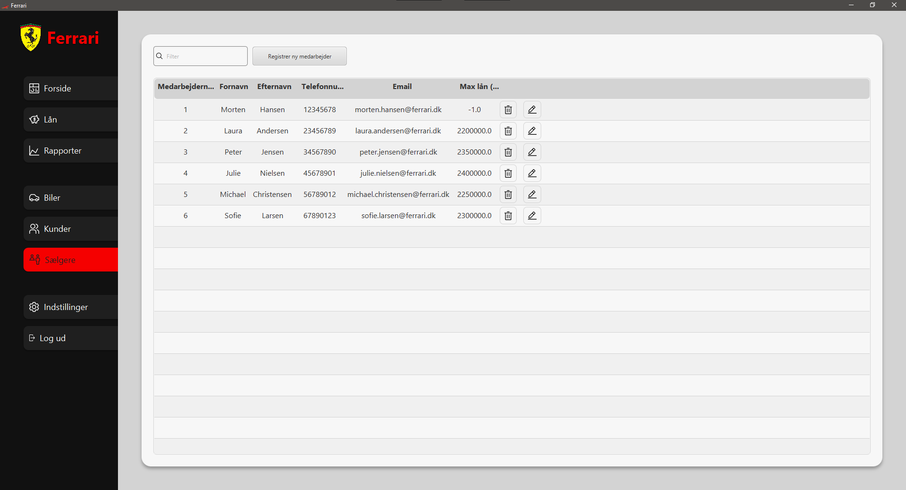
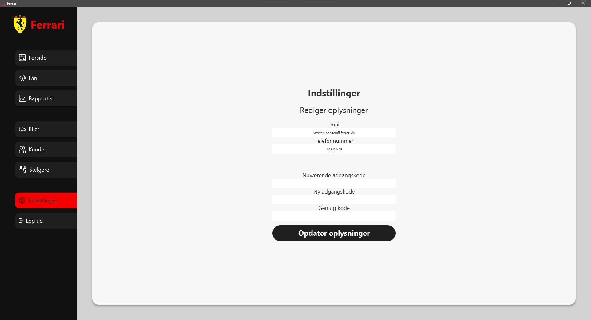

# Ferrari
This project shows the implementation of an application, of which the intention
is to optimize the time spent by sellers and the sales manager in a local car dealership.

## Assignment Information
The sellers are not authorized to accept all car loans, when this is the case they have to physically talk to the manager, to get the approval, which includes paperwork.
Some times the sales manager is on business trips to Italy, where getting the loans approved will either have to wait or not done at all. This is suboptimal.

The assignment goal is to create an application, that the sellers can use, to easily create and update loans, while also having interaction with an API (provided in the source code), that checks the credit-worthiness for the customer (RKI), as well as getting the rent by making API calls to the bank.

Threading should be used where optimal, to avoid that the GUI freezes, while interacting with it.

The source code should involve testing with JUnit.

## MVP (Minimum Viable Product)
- CRUD functionality should be limited if it's not the manager. The following things should _not_ be possible if it's a regular seller:
  - Deleting and updating loans.
  - Deleting and updating customers.
  - Creating, updating and deleting cars.
<!-- TODO: More goals -->

## Technicalities
- The "API" is located in `/src/main/java/dk/api`.
- The project requires Maven to run.
- By default it tries connecting to an SQL Server, from the connection string specified in the environment variable `SQL_SERVER_CONNECTION`. However, one can just choose to comment out `Database.init()` in `Main.java`.

## Screenshots

### Login

### Loans

### Cars

### Customers

### Employees

### Settings
